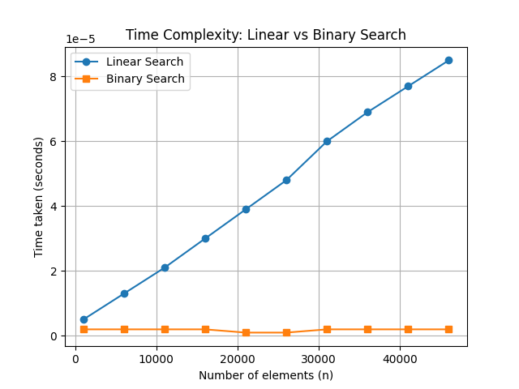
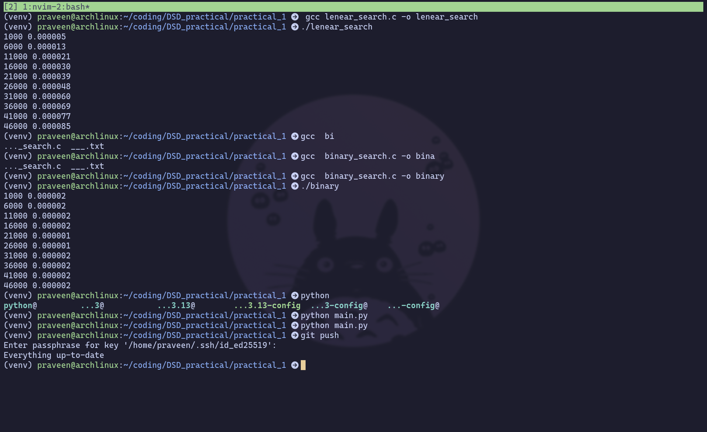

# Search Algorithms Experiment

---

## 1(a) Linear Search in C

### Pseudocode
```
procedure linear_search(A, n, key):
    for i ← 0 to n-1 do
        if A[i] = key then
            return i
    return -1
```

### C Code
```
#include <stdio.h>
#include <stdlib.h>
#include <time.h>

// Linear Search function
int linear_search(int arr[], int n, int key) {
    for (int i = 0; i < n; i++) {
        if (arr[i] == key)
            return i;
    }
    return -1;
}

int main() {
    int n, key, pos;
    clock_t start, end;
    double cpu_time_used;

    for (n = 1000; n <= 50000; n += 5000) {
        int *arr = (int*)malloc(n * sizeof(int));
        for (int i = 0; i < n; i++) arr[i] = i;

        key = n - 1; // worst case

        start = clock();
        pos = linear_search(arr, n, key);
        end = clock();

        cpu_time_used = ((double)(end - start)) / CLOCKS_PER_SEC;
        printf("%d %f\n", n, cpu_time_used);

        free(arr);
    }
    return 0;
}
```

---

## 1(b) Binary Search in C

### Pseudocode
```
procedure binary_search(A, n, key):
    low ← 0
    high ← n - 1
    while low ≤ high do
        mid ← (low + high) / 2
        if A[mid] = key then
            return mid
        else if A[mid] < key then
            low ← mid + 1
        else
            high ← mid - 1
    return -1
```

### C Code
```
#include <stdio.h>
#include <stdlib.h>
#include <time.h>

// Binary Search function
int binary_search(int arr[], int n, int key) {
    int low = 0, high = n - 1, mid;
    while (low <= high) {
        mid = (low + high) / 2;
        if (arr[mid] == key)
            return mid;
        else if (arr[mid] < key)
            low = mid + 1;
        else
            high = mid - 1;
    }
    return -1;
}

int main() {
    int n, key, pos;
    clock_t start, end;
    double cpu_time_used;

    for (n = 1000; n <= 50000; n += 5000) {
        int *arr = (int*)malloc(n * sizeof(int));
        for (int i = 0; i < n; i++) arr[i] = i;

        key = n - 1; // worst case

        start = clock();
        pos = binary_search(arr, n, key);
        end = clock();

        cpu_time_used = ((double)(end - start)) / CLOCKS_PER_SEC;
        printf("%d %f\n", n, cpu_time_used);

        free(arr);
    }
    return 0;
}
```

---

## Python Code for Plotting
```
import matplotlib.pyplot as plt

linear_n, linear_t = [], []
with open("linear.txt") as f:
    for line in f:
        n, t = line.split()
        linear_n.append(int(n))
        linear_t.append(float(t))

binary_n, binary_t = [], []
with open("binary.txt") as f:
    for line in f:
        n, t = line.split()
        binary_n.append(int(n))
        binary_t.append(float(t))

plt.plot(linear_n, linear_t, marker='o', label="Linear Search")
plt.plot(binary_n, binary_t, marker='s', label="Binary Search")

plt.xlabel("Number of elements (n)")
plt.ylabel("Time taken (seconds)")
plt.title("Time Complexity: Linear vs Binary Search")
plt.legend()
plt.grid(True)

plt.savefig("search_plot.png")   # save instead of show
print("Plot saved as search_plot.png")
```

---

## Output Plot


