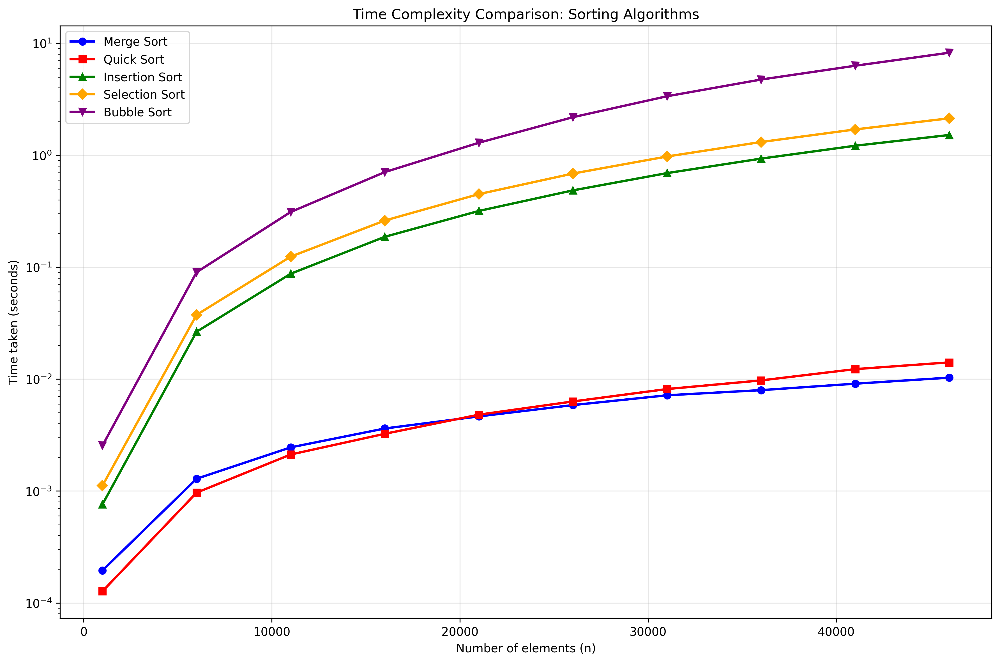
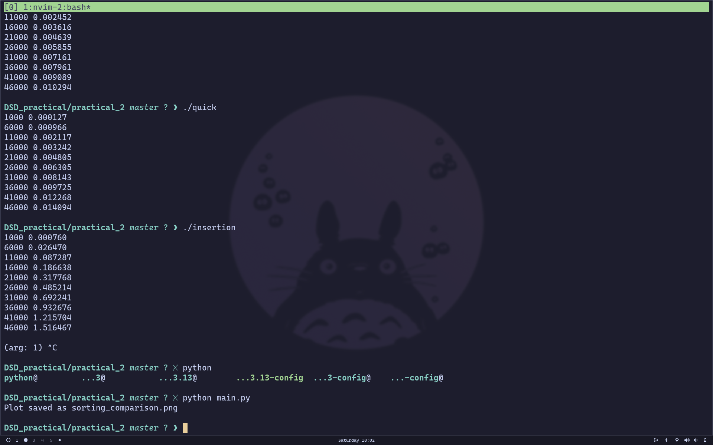

# Sorting Algorithms Experiment

---

[github_repo](https://github.com/praveen70140/DSD_practical/tree/master)

## 2(a) Merge Sort in C

### Pseudocode

```
procedure merge_sort(A, low, high):
    if low < high then
        mid ← (low + high) / 2
        merge_sort(A, low, mid)
        merge_sort(A, mid + 1, high)
        merge(A, low, mid, high)

procedure merge(A, low, mid, high):
    create temporary arrays L and R
    copy A[low...mid] to L
    copy A[mid+1...high] to R
    merge L and R back into A[low...high]
```

### C Code

```c
#include <stdio.h>
#include <stdlib.h>
#include <time.h>

void merge(int arr[], int low, int mid, int high) {
    int i, j, k;
    int n1 = mid - low + 1;
    int n2 = high - mid;
    
    int *L = (int*)malloc(n1 * sizeof(int));
    int *R = (int*)malloc(n2 * sizeof(int));
    
    for (i = 0; i < n1; i++)
        L[i] = arr[low + i];
    for (j = 0; j < n2; j++)
        R[j] = arr[mid + 1 + j];
    
    i = 0; j = 0; k = low;
    while (i < n1 && j < n2) {
        if (L[i] <= R[j]) {
            arr[k] = L[i];
            i++;
        } else {
            arr[k] = R[j];
            j++;
        }
        k++;
    }
    
    while (i < n1) {
        arr[k] = L[i];
        i++;
        k++;
    }
    
    while (j < n2) {
        arr[k] = R[j];
        j++;
        k++;
    }
    
    free(L);
    free(R);
}

void merge_sort(int arr[], int low, int high) {
    if (low < high) {
        int mid = low + (high - low) / 2;
        merge_sort(arr, low, mid);
        merge_sort(arr, mid + 1, high);
        merge(arr, low, mid, high);
    }
}

int main() {
    int n;
    clock_t start, end;
    double cpu_time_used;
    
    for (n = 1000; n <= 50000; n += 5000) {
        int *arr = (int*)malloc(n * sizeof(int));
        
        // Generate random array
        srand(time(NULL));
        for (int i = 0; i < n; i++) {
            arr[i] = rand() % 1000;
        }
        
        start = clock();
        merge_sort(arr, 0, n - 1);
        end = clock();
        
        cpu_time_used = ((double)(end - start)) / CLOCKS_PER_SEC;
        printf("%d %f\n", n, cpu_time_used);
        
        free(arr);
    }
    return 0;
}
```

---

## 2(b) Quick Sort in C

### Pseudocode

```
procedure quick_sort(A, low, high):
    if low < high then
        pivot_index ← partition(A, low, high)
        quick_sort(A, low, pivot_index - 1)
        quick_sort(A, pivot_index + 1, high)

procedure partition(A, low, high):
    pivot ← A[high]
    i ← low - 1
    for j ← low to high - 1 do
        if A[j] ≤ pivot then
            i ← i + 1
            swap A[i] and A[j]
    swap A[i + 1] and A[high]
    return i + 1
```

### C Code

```c
#include <stdio.h>
#include <stdlib.h>
#include <time.h>

void swap(int* a, int* b) {
    int temp = *a;
    *a = *b;
    *b = temp;
}

int partition(int arr[], int low, int high) {
    int pivot = arr[high];
    int i = (low - 1);
    
    for (int j = low; j <= high - 1; j++) {
        if (arr[j] <= pivot) {
            i++;
            swap(&arr[i], &arr[j]);
        }
    }
    swap(&arr[i + 1], &arr[high]);
    return (i + 1);
}

void quick_sort(int arr[], int low, int high) {
    if (low < high) {
        int pi = partition(arr, low, high);
        quick_sort(arr, low, pi - 1);
        quick_sort(arr, pi + 1, high);
    }
}

int main() {
    int n;
    clock_t start, end;
    double cpu_time_used;
    
    for (n = 1000; n <= 50000; n += 5000) {
        int *arr = (int*)malloc(n * sizeof(int));
        
        // Generate random array
        srand(time(NULL));
        for (int i = 0; i < n; i++) {
            arr[i] = rand() % 1000;
        }
        
        start = clock();
        quick_sort(arr, 0, n - 1);
        end = clock();
        
        cpu_time_used = ((double)(end - start)) / CLOCKS_PER_SEC;
        printf("%d %f\n", n, cpu_time_used);
        
        free(arr);
    }
    return 0;
}
```

---

## 2(c) Insertion Sort in C

### Pseudocode

```
procedure insertion_sort(A, n):
    for i ← 1 to n-1 do
        key ← A[i]
        j ← i - 1
        while j ≥ 0 and A[j] > key do
            A[j + 1] ← A[j]
            j ← j - 1
        A[j + 1] ← key
```

### C Code

```c
#include <stdio.h>
#include <stdlib.h>
#include <time.h>

void insertion_sort(int arr[], int n) {
    int i, key, j;
    for (i = 1; i < n; i++) {
        key = arr[i];
        j = i - 1;
        
        while (j >= 0 && arr[j] > key) {
            arr[j + 1] = arr[j];
            j = j - 1;
        }
        arr[j + 1] = key;
    }
}

int main() {
    int n;
    clock_t start, end;
    double cpu_time_used;
    
    for (n = 1000; n <= 50000; n += 5000) {
        int *arr = (int*)malloc(n * sizeof(int));
        
        // Generate random array
        srand(time(NULL));
        for (int i = 0; i < n; i++) {
            arr[i] = rand() % 1000;
        }
        
        start = clock();
        insertion_sort(arr, n);
        end = clock();
        
        cpu_time_used = ((double)(end - start)) / CLOCKS_PER_SEC;
        printf("%d %f\n", n, cpu_time_used);
        
        free(arr);
    }
    return 0;
}
```

---

## 2(d) Selection Sort in C

### Pseudocode

```
procedure selection_sort(A, n):
    for i ← 0 to n-2 do
        min_index ← i
        for j ← i+1 to n-1 do
            if A[j] < A[min_index] then
                min_index ← j
        swap A[i] and A[min_index]
```

### C Code

```c
#include <stdio.h>
#include <stdlib.h>
#include <time.h>

void swap(int* a, int* b) {
    int temp = *a;
    *a = *b;
    *b = temp;
}

void selection_sort(int arr[], int n) {
    int i, j, min_idx;
    
    for (i = 0; i < n - 1; i++) {
        min_idx = i;
        for (j = i + 1; j < n; j++) {
            if (arr[j] < arr[min_idx])
                min_idx = j;
        }
        swap(&arr[min_idx], &arr[i]);
    }
}

int main() {
    int n;
    clock_t start, end;
    double cpu_time_used;
    
    for (n = 1000; n <= 50000; n += 5000) {
        int *arr = (int*)malloc(n * sizeof(int));
        
        // Generate random array
        srand(time(NULL));
        for (int i = 0; i < n; i++) {
            arr[i] = rand() % 1000;
        }
        
        start = clock();
        selection_sort(arr, n);
        end = clock();
        
        cpu_time_used = ((double)(end - start)) / CLOCKS_PER_SEC;
        printf("%d %f\n", n, cpu_time_used);
        
        free(arr);
    }
    return 0;
}
```

---

## 2(e) Bubble Sort in C

### Pseudocode

```
procedure bubble_sort(A, n):
    for i ← 0 to n-2 do
        for j ← 0 to n-2-i do
            if A[j] > A[j+1] then
                swap A[j] and A[j+1]
```

### C Code

```c
#include <stdio.h>
#include <stdlib.h>
#include <time.h>

void swap(int* a, int* b) {
    int temp = *a;
    *a = *b;
    *b = temp;
}

void bubble_sort(int arr[], int n) {
    int i, j;
    for (i = 0; i < n - 1; i++) {
        for (j = 0; j < n - i - 1; j++) {
            if (arr[j] > arr[j + 1]) {
                swap(&arr[j], &arr[j + 1]);
            }
        }
    }
}

int main() {
    int n;
    clock_t start, end;
    double cpu_time_used;
    
    for (n = 1000; n <= 50000; n += 5000) {
        int *arr = (int*)malloc(n * sizeof(int));
        
        // Generate random array
        srand(time(NULL));
        for (int i = 0; i < n; i++) {
            arr[i] = rand() % 1000;
        }
        
        start = clock();
        bubble_sort(arr, n);
        end = clock();
        
        cpu_time_used = ((double)(end - start)) / CLOCKS_PER_SEC;
        printf("%d %f\n", n, cpu_time_used);
        
        free(arr);
    }
    return 0;
}
```

---

## Python Code for Plotting

```python
import matplotlib.pyplot as plt

# Read data for all sorting algorithms
algorithms = ['merge', 'quick', 'insertion', 'selection', 'bubble']
colors = ['blue', 'red', 'green', 'orange', 'purple']
markers = ['o', 's', '^', 'D', 'v']

plt.figure(figsize=(12, 8))

for i, algo in enumerate(algorithms):
    n_values, time_values = [], []
    try:
        with open(f"{algo}.txt") as f:
            for line in f:
                n, t = line.split()
                n_values.append(int(n))
                time_values.append(float(t))
        
        plt.plot(n_values, time_values, marker=markers[i], 
                color=colors[i], label=f"{algo.capitalize()} Sort", linewidth=2)
    except FileNotFoundError:
        print(f"Warning: {algo}.txt not found")

plt.xlabel("Number of elements (n)")
plt.ylabel("Time taken (seconds)")
plt.title("Time Complexity Comparison: Sorting Algorithms")
plt.legend()
plt.grid(True, alpha=0.3)
plt.yscale('log')  # Log scale for better visualization

plt.tight_layout()
plt.savefig("sorting_comparison.png", dpi=300, bbox_inches='tight')
print("Plot saved as sorting_comparison.png")
```

---

## Output Plot




