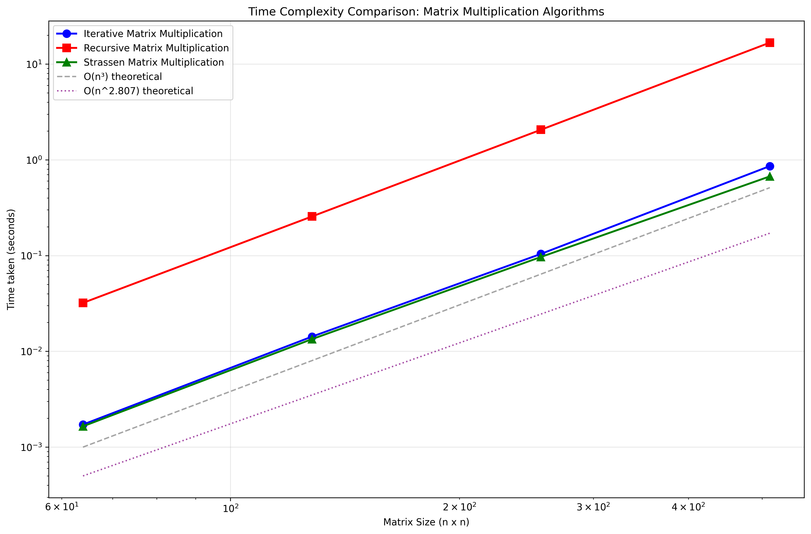
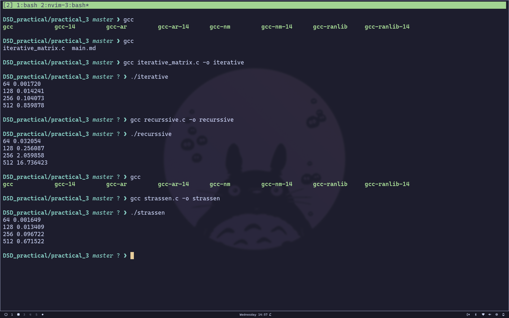

# Matrix Multiplication Algorithms Experiment

---

[github_repo](https://github.com/praveen70140/DSD_practical/tree/master)

## 3(a) Iterative Matrix Multiplication in C

### Pseudocode

```
procedure iterative_matrix_multiply(A, B, C, n):
    for i ← 0 to n-1 do
        for j ← 0 to n-1 do
            C[i][j] ← 0
            for k ← 0 to n-1 do
                C[i][j] ← C[i][j] + A[i][k] * B[k][j]
```

### C Code

```c
#include <stdio.h>
#include <stdlib.h>
#include <time.h>

void iterative_matrix_multiply(int **A, int **B, int **C, int n) {
    for (int i = 0; i < n; i++) {
        for (int j = 0; j < n; j++) {
            C[i][j] = 0;
            for (int k = 0; k < n; k++) {
                C[i][j] += A[i][k] * B[k][j];
            }
        }
    }
}

int** allocate_matrix(int n) {
    int **matrix = (int**)malloc(n * sizeof(int*));
    for (int i = 0; i < n; i++) {
        matrix[i] = (int*)malloc(n * sizeof(int));
    }
    return matrix;
}

void free_matrix(int **matrix, int n) {
    for (int i = 0; i < n; i++) {
        free(matrix[i]);
    }
    free(matrix);
}

void initialize_matrix(int **matrix, int n) {
    for (int i = 0; i < n; i++) {
        for (int j = 0; j < n; j++) {
            matrix[i][j] = rand() % 10 + 1;
        }
    }
}

int main() {
    int n;
    clock_t start, end;
    double cpu_time_used;
    
    srand(time(NULL));
    
    for (n = 64; n <= 512; n *= 2) {
        int **A = allocate_matrix(n);
        int **B = allocate_matrix(n);
        int **C = allocate_matrix(n);
        
        initialize_matrix(A, n);
        initialize_matrix(B, n);
        
        start = clock();
        iterative_matrix_multiply(A, B, C, n);
        end = clock();
        
        cpu_time_used = ((double)(end - start)) / CLOCKS_PER_SEC;
        printf("%d %f\n", n, cpu_time_used);
        
        free_matrix(A, n);
        free_matrix(B, n);
        free_matrix(C, n);
    }
    return 0;
}
```

---

## 3(b) Recursive Matrix Multiplication in C

### Pseudocode

```
procedure recursive_matrix_multiply(A, B, C, n):
    if n = 1 then
        C[0][0] ← A[0][0] * B[0][0]
    else
        // Divide matrices into quadrants
        partition A into A11, A12, A21, A22
        partition B into B11, B12, B21, B22
        partition C into C11, C12, C21, C22
        
        // Recursive multiplication
        recursive_matrix_multiply(A11, B11, temp1, n/2)
        recursive_matrix_multiply(A12, B21, temp2, n/2)
        matrix_add(temp1, temp2, C11, n/2)
        
        recursive_matrix_multiply(A11, B12, temp1, n/2)
        recursive_matrix_multiply(A12, B22, temp2, n/2)
        matrix_add(temp1, temp2, C12, n/2)
        
        recursive_matrix_multiply(A21, B11, temp1, n/2)
        recursive_matrix_multiply(A22, B21, temp2, n/2)
        matrix_add(temp1, temp2, C21, n/2)
        
        recursive_matrix_multiply(A21, B12, temp1, n/2)
        recursive_matrix_multiply(A22, B22, temp2, n/2)
        matrix_add(temp1, temp2, C22, n/2)
```

### C Code

```c
#include <stdio.h>
#include <stdlib.h>
#include <time.h>

int** allocate_matrix(int n) {
    int **matrix = (int**)malloc(n * sizeof(int*));
    for (int i = 0; i < n; i++) {
        matrix[i] = (int*)malloc(n * sizeof(int));
    }
    return matrix;
}

void free_matrix(int **matrix, int n) {
    for (int i = 0; i < n; i++) {
        free(matrix[i]);
    }
    free(matrix);
}

void matrix_add(int **A, int **B, int **C, int n) {
    for (int i = 0; i < n; i++) {
        for (int j = 0; j < n; j++) {
            C[i][j] = A[i][j] + B[i][j];
        }
    }
}

void recursive_matrix_multiply(int **A, int **B, int **C, int n) {
    if (n == 1) {
        C[0][0] = A[0][0] * B[0][0];
        return;
    }
    
    int half = n / 2;
    
    // Allocate memory for submatrices
    int **A11 = allocate_matrix(half);
    int **A12 = allocate_matrix(half);
    int **A21 = allocate_matrix(half);
    int **A22 = allocate_matrix(half);
    
    int **B11 = allocate_matrix(half);
    int **B12 = allocate_matrix(half);
    int **B21 = allocate_matrix(half);
    int **B22 = allocate_matrix(half);
    
    int **C11 = allocate_matrix(half);
    int **C12 = allocate_matrix(half);
    int **C21 = allocate_matrix(half);
    int **C22 = allocate_matrix(half);
    
    int **temp1 = allocate_matrix(half);
    int **temp2 = allocate_matrix(half);
    
    // Divide matrices into quadrants
    for (int i = 0; i < half; i++) {
        for (int j = 0; j < half; j++) {
            A11[i][j] = A[i][j];
            A12[i][j] = A[i][j + half];
            A21[i][j] = A[i + half][j];
            A22[i][j] = A[i + half][j + half];
            
            B11[i][j] = B[i][j];
            B12[i][j] = B[i][j + half];
            B21[i][j] = B[i + half][j];
            B22[i][j] = B[i + half][j + half];
        }
    }
    
    // C11 = A11*B11 + A12*B21
    recursive_matrix_multiply(A11, B11, temp1, half);
    recursive_matrix_multiply(A12, B21, temp2, half);
    matrix_add(temp1, temp2, C11, half);
    
    // C12 = A11*B12 + A12*B22
    recursive_matrix_multiply(A11, B12, temp1, half);
    recursive_matrix_multiply(A12, B22, temp2, half);
    matrix_add(temp1, temp2, C12, half);
    
    // C21 = A21*B11 + A22*B21
    recursive_matrix_multiply(A21, B11, temp1, half);
    recursive_matrix_multiply(A22, B21, temp2, half);
    matrix_add(temp1, temp2, C21, half);
    
    // C22 = A21*B12 + A22*B22
    recursive_matrix_multiply(A21, B12, temp1, half);
    recursive_matrix_multiply(A22, B22, temp2, half);
    matrix_add(temp1, temp2, C22, half);
    
    // Combine results
    for (int i = 0; i < half; i++) {
        for (int j = 0; j < half; j++) {
            C[i][j] = C11[i][j];
            C[i][j + half] = C12[i][j];
            C[i + half][j] = C21[i][j];
            C[i + half][j + half] = C22[i][j];
        }
    }
    
    // Free memory
    free_matrix(A11, half); free_matrix(A12, half); free_matrix(A21, half); free_matrix(A22, half);
    free_matrix(B11, half); free_matrix(B12, half); free_matrix(B21, half); free_matrix(B22, half);
    free_matrix(C11, half); free_matrix(C12, half); free_matrix(C21, half); free_matrix(C22, half);
    free_matrix(temp1, half); free_matrix(temp2, half);
}

void initialize_matrix(int **matrix, int n) {
    for (int i = 0; i < n; i++) {
        for (int j = 0; j < n; j++) {
            matrix[i][j] = rand() % 10 + 1;
        }
    }
}

int main() {
    int n;
    clock_t start, end;
    double cpu_time_used;
    
    srand(time(NULL));
    
    for (n = 64; n <= 512; n *= 2) {
        int **A = allocate_matrix(n);
        int **B = allocate_matrix(n);
        int **C = allocate_matrix(n);
        
        initialize_matrix(A, n);
        initialize_matrix(B, n);
        
        start = clock();
        recursive_matrix_multiply(A, B, C, n);
        end = clock();
        
        cpu_time_used = ((double)(end - start)) / CLOCKS_PER_SEC;
        printf("%d %f\n", n, cpu_time_used);
        
        free_matrix(A, n);
        free_matrix(B, n);
        free_matrix(C, n);
    }
    return 0;
}
```

---

## 3(c) Strassen's Matrix Multiplication in C

### Pseudocode

```
procedure strassen_multiply(A, B, C, n):
    if n ≤ threshold then
        iterative_matrix_multiply(A, B, C, n)
    else
        // Divide matrices into quadrants
        partition A into A11, A12, A21, A22
        partition B into B11, B12, B21, B22
        
        // Calculate 7 products using Strassen's method
        M1 ← strassen_multiply(A11 + A22, B11 + B22)
        M2 ← strassen_multiply(A21 + A22, B11)
        M3 ← strassen_multiply(A11, B12 - B22)
        M4 ← strassen_multiply(A22, B21 - B11)
        M5 ← strassen_multiply(A11 + A12, B22)
        M6 ← strassen_multiply(A21 - A11, B11 + B12)
        M7 ← strassen_multiply(A12 - A22, B21 + B22)
        
        // Combine results
        C11 ← M1 + M4 - M5 + M7
        C12 ← M3 + M5
        C21 ← M2 + M4
        C22 ← M1 - M2 + M3 + M6
```

### C Code

```c
#include <stdio.h>
#include <stdlib.h>
#include <time.h>

#define THRESHOLD 64

int** allocate_matrix(int n) {
    int **matrix = (int**)malloc(n * sizeof(int*));
    for (int i = 0; i < n; i++) {
        matrix[i] = (int*)malloc(n * sizeof(int));
    }
    return matrix;
}

void free_matrix(int **matrix, int n) {
    for (int i = 0; i < n; i++) {
        free(matrix[i]);
    }
    free(matrix);
}

void matrix_add(int **A, int **B, int **C, int n) {
    for (int i = 0; i < n; i++) {
        for (int j = 0; j < n; j++) {
            C[i][j] = A[i][j] + B[i][j];
        }
    }
}

void matrix_subtract(int **A, int **B, int **C, int n) {
    for (int i = 0; i < n; i++) {
        for (int j = 0; j < n; j++) {
            C[i][j] = A[i][j] - B[i][j];
        }
    }
}

void iterative_matrix_multiply(int **A, int **B, int **C, int n) {
    for (int i = 0; i < n; i++) {
        for (int j = 0; j < n; j++) {
            C[i][j] = 0;
            for (int k = 0; k < n; k++) {
                C[i][j] += A[i][k] * B[k][j];
            }
        }
    }
}

void strassen_multiply(int **A, int **B, int **C, int n) {
    if (n <= THRESHOLD) {
        iterative_matrix_multiply(A, B, C, n);
        return;
    }
    
    int half = n / 2;
    
    // Allocate memory for submatrices
    int **A11 = allocate_matrix(half);
    int **A12 = allocate_matrix(half);
    int **A21 = allocate_matrix(half);
    int **A22 = allocate_matrix(half);
    
    int **B11 = allocate_matrix(half);
    int **B12 = allocate_matrix(half);
    int **B21 = allocate_matrix(half);
    int **B22 = allocate_matrix(half);
    
    int **M1 = allocate_matrix(half);
    int **M2 = allocate_matrix(half);
    int **M3 = allocate_matrix(half);
    int **M4 = allocate_matrix(half);
    int **M5 = allocate_matrix(half);
    int **M6 = allocate_matrix(half);
    int **M7 = allocate_matrix(half);
    
    int **temp1 = allocate_matrix(half);
    int **temp2 = allocate_matrix(half);
    
    // Divide matrices into quadrants
    for (int i = 0; i < half; i++) {
        for (int j = 0; j < half; j++) {
            A11[i][j] = A[i][j];
            A12[i][j] = A[i][j + half];
            A21[i][j] = A[i + half][j];
            A22[i][j] = A[i + half][j + half];
            
            B11[i][j] = B[i][j];
            B12[i][j] = B[i][j + half];
            B21[i][j] = B[i + half][j];
            B22[i][j] = B[i + half][j + half];
        }
    }
    
    // Calculate the 7 products
    // M1 = (A11 + A22) * (B11 + B22)
    matrix_add(A11, A22, temp1, half);
    matrix_add(B11, B22, temp2, half);
    strassen_multiply(temp1, temp2, M1, half);
    
    // M2 = (A21 + A22) * B11
    matrix_add(A21, A22, temp1, half);
    strassen_multiply(temp1, B11, M2, half);
    
    // M3 = A11 * (B12 - B22)
    matrix_subtract(B12, B22, temp2, half);
    strassen_multiply(A11, temp2, M3, half);
    
    // M4 = A22 * (B21 - B11)
    matrix_subtract(B21, B11, temp2, half);
    strassen_multiply(A22, temp2, M4, half);
    
    // M5 = (A11 + A12) * B22
    matrix_add(A11, A12, temp1, half);
    strassen_multiply(temp1, B22, M5, half);
    
    // M6 = (A21 - A11) * (B11 + B12)
    matrix_subtract(A21, A11, temp1, half);
    matrix_add(B11, B12, temp2, half);
    strassen_multiply(temp1, temp2, M6, half);
    
    // M7 = (A12 - A22) * (B21 + B22)
    matrix_subtract(A12, A22, temp1, half);
    matrix_add(B21, B22, temp2, half);
    strassen_multiply(temp1, temp2, M7, half);
    
    // Calculate C quadrants
    // C11 = M1 + M4 - M5 + M7
    matrix_add(M1, M4, temp1, half);
    matrix_subtract(temp1, M5, temp2, half);
    matrix_add(temp2, M7, temp1, half);
    
    // C12 = M3 + M5
    matrix_add(M3, M5, temp2, half);
    
    // C21 = M2 + M4
    int **temp3 = allocate_matrix(half);
    matrix_add(M2, M4, temp3, half);
    
    // C22 = M1 - M2 + M3 + M6
    int **temp4 = allocate_matrix(half);
    matrix_subtract(M1, M2, temp4, half);
    matrix_add(temp4, M3, temp4, half);
    matrix_add(temp4, M6, temp4, half);
    
    // Combine results into C
    for (int i = 0; i < half; i++) {
        for (int j = 0; j < half; j++) {
            C[i][j] = temp1[i][j];              // C11
            C[i][j + half] = temp2[i][j];       // C12
            C[i + half][j] = temp3[i][j];       // C21
            C[i + half][j + half] = temp4[i][j]; // C22
        }
    }
    
    // Free memory
    free_matrix(A11, half); free_matrix(A12, half); free_matrix(A21, half); free_matrix(A22, half);
    free_matrix(B11, half); free_matrix(B12, half); free_matrix(B21, half); free_matrix(B22, half);
    free_matrix(M1, half); free_matrix(M2, half); free_matrix(M3, half); free_matrix(M4, half);
    free_matrix(M5, half); free_matrix(M6, half); free_matrix(M7, half);
    free_matrix(temp1, half); free_matrix(temp2, half); free_matrix(temp3, half); free_matrix(temp4, half);
}

void initialize_matrix(int **matrix, int n) {
    for (int i = 0; i < n; i++) {
        for (int j = 0; j < n; j++) {
            matrix[i][j] = rand() % 10 + 1;
        }
    }
}

int main() {
    int n;
    clock_t start, end;
    double cpu_time_used;
    
    srand(time(NULL));
    
    for (n = 64; n <= 512; n *= 2) {
        int **A = allocate_matrix(n);
        int **B = allocate_matrix(n);
        int **C = allocate_matrix(n);
        
        initialize_matrix(A, n);
        initialize_matrix(B, n);
        
        start = clock();
        strassen_multiply(A, B, C, n);
        end = clock();
        
        cpu_time_used = ((double)(end - start)) / CLOCKS_PER_SEC;
        printf("%d %f\n", n, cpu_time_used);
        
        free_matrix(A, n);
        free_matrix(B, n);
        free_matrix(C, n);
    }
    return 0;
}
```

---

## Python Code for Plotting

```python
import matplotlib.pyplot as plt

# Read data for all matrix multiplication algorithms
algorithms = ['iterative', 'recursive', 'strassen']
colors = ['blue', 'red', 'green']
markers = ['o', 's', '^']

plt.figure(figsize=(12, 8))

for i, algo in enumerate(algorithms):
    n_values, time_values = [], []
    try:
        with open(f"{algo}.txt") as f:
            for line in f:
                n, t = line.split()
                n_values.append(int(n))
                time_values.append(float(t))
        
        plt.plot(n_values, time_values, marker=markers[i], 
                color=colors[i], label=f"{algo.capitalize()} Matrix Multiplication", 
                linewidth=2, markersize=8)
    except FileNotFoundError:
        print(f"Warning: {algo}.txt not found")

plt.xlabel("Matrix Size (n x n)")
plt.ylabel("Time taken (seconds)")
plt.title("Time Complexity Comparison: Matrix Multiplication Algorithms")
plt.legend()
plt.grid(True, alpha=0.3)
plt.yscale('log')  # Log scale for better visualization
plt.xscale('log')  # Log scale for matrix sizes

# Add theoretical complexity lines
n_theoretical = [64, 128, 256, 512]
n3_line = [n**3 / 64**3 * 0.001 for n in n_theoretical]  # O(n^3) for iterative
n_log7_line = [n**2.807 / 64**2.807 * 0.0005 for n in n_theoretical]  # O(n^log7) for Strassen

plt.plot(n_theoretical, n3_line, '--', color='gray', alpha=0.7, label='O(n³) theoretical')
plt.plot(n_theoretical, n_log7_line, ':', color='purple', alpha=0.7, label='O(n^2.807) theoretical')

plt.legend()
plt.tight_layout()
plt.savefig("matrix_multiplication_comparison.png", dpi=300, bbox_inches='tight')
print("Plot saved as matrix_multiplication_comparison.png")
```

---

## Output Plot




