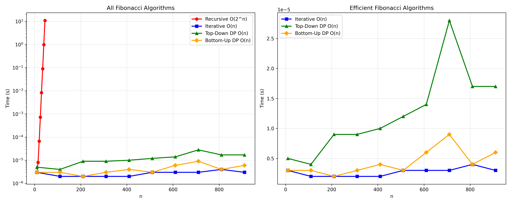
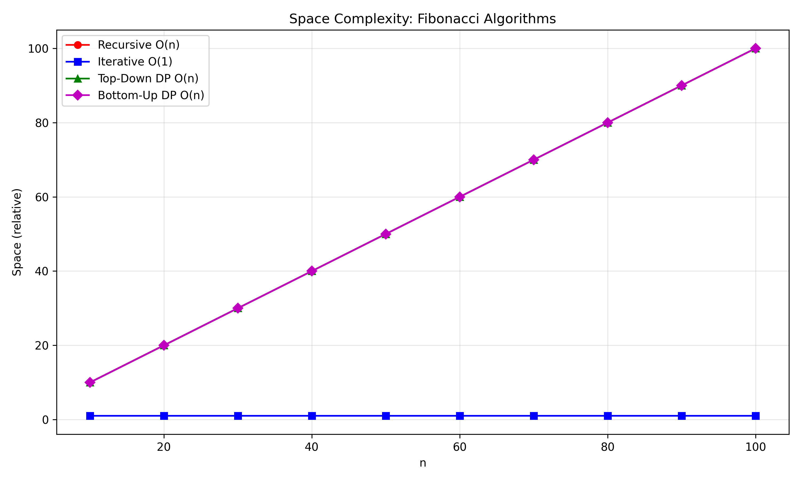

# Fibonacci Algorithms Experiment

---


## Objective
To implement and analyze different approaches for generating Fibonacci numbers and compare their time and space complexities through graph analysis.

## 4(a) Recursive Version of Fibonacci

### Algorithm

```
algorithm fibonacci_recursive(n):
    if n ≤ 1 then
        return n
    else
        return fibonacci_recursive(n-1) + fibonacci_recursive(n-2)
```

### Pseudocode

```
procedure fibonacci_recursive(n):
    if n = 0 then
        return 0
    else if n = 1 then
        return 1
    else
        return fibonacci_recursive(n-1) + fibonacci_recursive(n-2)
```

### C Code

```c
#include <stdio.h>
#include <stdlib.h>
#include <time.h>

long long fibonacci_recursive(int n) {
    if (n <= 1)
        return n;
    return fibonacci_recursive(n - 1) + fibonacci_recursive(n - 2);
}

int main() {
    int n;
    clock_t start, end;
    double cpu_time_used;
    long long result;
    
    printf("Recursive Fibonacci Results:\n");
    printf("n\tTime(seconds)\tResult\n");
    
    for (n = 10; n <= 45; n += 5) {
        start = clock();
        result = fibonacci_recursive(n);
        end = clock();
        
        cpu_time_used = ((double)(end - start)) / CLOCKS_PER_SEC;
        printf("%d\t%f\t%lld\n", n, cpu_time_used, result);
        
        // Save to file for plotting
        FILE *fp = fopen("recursive.txt", "a");
        fprintf(fp, "%d %f\n", n, cpu_time_used);
        fclose(fp);
    }
    return 0;
}
```

---

## 4(b) Iterative Version of Fibonacci

### Algorithm

```
algorithm fibonacci_iterative(n):
    if n ≤ 1 then
        return n
    prev1 ← 0
    prev2 ← 1
    for i ← 2 to n do
        current ← prev1 + prev2
        prev1 ← prev2
        prev2 ← current
    return prev2
```

### Pseudocode

```
procedure fibonacci_iterative(n):
    if n = 0 then
        return 0
    else if n = 1 then
        return 1
    else
        a ← 0
        b ← 1
        for i ← 2 to n do
            temp ← a + b
            a ← b
            b ← temp
        return b
```

### C Code

```c
#include <stdio.h>
#include <stdlib.h>
#include <time.h>

long long fibonacci_iterative(int n) {
    if (n <= 1)
        return n;
    
    long long prev1 = 0, prev2 = 1, current;
    
    for (int i = 2; i <= n; i++) {
        current = prev1 + prev2;
        prev1 = prev2;
        prev2 = current;
    }
    
    return prev2;
}

int main() {
    int n;
    clock_t start, end;
    double cpu_time_used;
    long long result;
    
    printf("Iterative Fibonacci Results:\n");
    printf("n\tTime(seconds)\tResult\n");
    
    for (n = 10; n <= 1000; n += 100) {
        start = clock();
        result = fibonacci_iterative(n);
        end = clock();
        
        cpu_time_used = ((double)(end - start)) / CLOCKS_PER_SEC;
        printf("%d\t%f\t%lld\n", n, cpu_time_used, result);
        
        // Save to file for plotting
        FILE *fp = fopen("iterative.txt", "a");
        fprintf(fp, "%d %f\n", n, cpu_time_used);
        fclose(fp);
    }
    return 0;
}
```

---

## 4(c) Dynamic Programming - Top Down Approach (Memoization)

### Algorithm

```
algorithm fibonacci_memoization(n, memo):
    if n ≤ 1 then
        return n
    if memo[n] ≠ -1 then
        return memo[n]
    memo[n] ← fibonacci_memoization(n-1, memo) + fibonacci_memoization(n-2, memo)
    return memo[n]
```

### Pseudocode

```
procedure fibonacci_top_down(n):
    create memo array of size n+1, initialize with -1
    return fibonacci_memoization_helper(n, memo)

procedure fibonacci_memoization_helper(n, memo):
    if n ≤ 1 then
        return n
    if memo[n] ≠ -1 then
        return memo[n]
    memo[n] ← fibonacci_memoization_helper(n-1, memo) + fibonacci_memoization_helper(n-2, memo)
    return memo[n]
```

### C Code

```c
#include <stdio.h>
#include <stdlib.h>
#include <time.h>

long long fibonacci_memoization_helper(int n, long long *memo) {
    if (n <= 1)
        return n;
    
    if (memo[n] != -1)
        return memo[n];
    
    memo[n] = fibonacci_memoization_helper(n - 1, memo) + 
              fibonacci_memoization_helper(n - 2, memo);
    
    return memo[n];
}

long long fibonacci_top_down(int n) {
    if (n <= 1)
        return n;
    
    long long *memo = (long long*)malloc((n + 1) * sizeof(long long));
    
    // Initialize memoization array
    for (int i = 0; i <= n; i++) {
        memo[i] = -1;
    }
    
    long long result = fibonacci_memoization_helper(n, memo);
    free(memo);
    return result;
}

int main() {
    int n;
    clock_t start, end;
    double cpu_time_used;
    long long result;
    
    printf("Top-Down DP Fibonacci Results:\n");
    printf("n\tTime(seconds)\tResult\n");
    
    for (n = 10; n <= 1000; n += 100) {
        start = clock();
        result = fibonacci_top_down(n);
        end = clock();
        
        cpu_time_used = ((double)(end - start)) / CLOCKS_PER_SEC;
        printf("%d\t%f\t%lld\n", n, cpu_time_used, result);
        
        // Save to file for plotting
        FILE *fp = fopen("top_down.txt", "a");
        fprintf(fp, "%d %f\n", n, cpu_time_used);
        fclose(fp);
    }
    return 0;
}
```

---

## 4(d) Dynamic Programming - Bottom Up Approach (Tabulation)

### Algorithm

```
algorithm fibonacci_bottom_up(n):
    if n ≤ 1 then
        return n
    create dp array of size n+1
    dp[0] ← 0
    dp[1] ← 1
    for i ← 2 to n do
        dp[i] ← dp[i-1] + dp[i-2]
    return dp[n]
```

### Pseudocode

```
procedure fibonacci_bottom_up(n):
    if n ≤ 1 then
        return n
    create dp array of size n+1
    dp[0] ← 0
    dp[1] ← 1
    for i ← 2 to n do
        dp[i] ← dp[i-1] + dp[i-2]
    return dp[n]
```

### C Code

```c
#include <stdio.h>
#include <stdlib.h>
#include <time.h>

long long fibonacci_bottom_up(int n) {
    if (n <= 1)
        return n;
    
    long long *dp = (long long*)malloc((n + 1) * sizeof(long long));
    
    dp[0] = 0;
    dp[1] = 1;
    
    for (int i = 2; i <= n; i++) {
        dp[i] = dp[i - 1] + dp[i - 2];
    }
    
    long long result = dp[n];
    free(dp);
    return result;
}

int main() {
    int n;
    clock_t start, end;
    double cpu_time_used;
    long long result;
    
    printf("Bottom-Up DP Fibonacci Results:\n");
    printf("n\tTime(seconds)\tResult\n");
    
    for (n = 10; n <= 1000; n += 100) {
        start = clock();
        result = fibonacci_bottom_up(n);
        end = clock();
        
        cpu_time_used = ((double)(end - start)) / CLOCKS_PER_SEC;
        printf("%d\t%f\t%lld\n", n, cpu_time_used, result);
        
        // Save to file for plotting
        FILE *fp = fopen("bottom_up.txt", "a");
        fprintf(fp, "%d %f\n", n, cpu_time_used);
        fclose(fp);
    }
    return 0;
}
```

---

## Complexity Analysis

| Approach | Time Complexity | Space Complexity | Description |
|----------|----------------|------------------|-------------|
| Recursive | O(2^n) | O(n) | Exponential time due to repeated calculations |
| Iterative | O(n) | O(1) | Linear time with constant space |
| Top-Down DP | O(n) | O(n) | Linear time and space with memoization |
| Bottom-Up DP | O(n) | O(n) | Linear time and space with tabulation |

---

## Python Code for Plotting

```python
import matplotlib.pyplot as plt
import numpy as np

# Read data for all fibonacci algorithms
algorithms = ['recursive', 'iterative', 'top_down', 'bottom_up']
colors = ['red', 'blue', 'green', 'orange']
markers = ['o', 's', '^', 'D']
labels = ['Recursive O(2^n)', 'Iterative O(n)', 'Top-Down DP O(n)', 'Bottom-Up DP O(n)']

plt.figure(figsize=(15, 10))

# Create two subplots
fig, (ax1, ax2) = plt.subplots(1, 2, figsize=(15, 6))

# Plot 1: All algorithms (log scale)
for i, algo in enumerate(algorithms):
    n_values, time_values = [], []
    try:
        with open(f"{algo}.txt") as f:
            for line in f:
                n, t = line.split()
                n_values.append(int(n))
                time_values.append(float(t))
        
        ax1.plot(n_values, time_values, marker=markers[i], 
                color=colors[i], label=labels[i], linewidth=2, markersize=6)
    except FileNotFoundError:
        print(f"Warning: {algo}.txt not found")

ax1.set_xlabel("Fibonacci Number (n)")
ax1.set_ylabel("Time taken (seconds)")
ax1.set_title("Time Complexity: All Fibonacci Algorithms")
ax1.legend()
ax1.grid(True, alpha=0.3)
ax1.set_yscale('log')

# Plot 2: Efficient algorithms only (linear scale)
efficient_algos = ['iterative', 'top_down', 'bottom_up']
efficient_colors = ['blue', 'green', 'orange']
efficient_markers = ['s', '^', 'D']
efficient_labels = ['Iterative O(n)', 'Top-Down DP O(n)', 'Bottom-Up DP O(n)']

for i, algo in enumerate(efficient_algos):
    n_values, time_values = [], []
    try:
        with open(f"{algo}.txt") as f:
            for line in f:
                n, t = line.split()
                n_values.append(int(n))
                time_values.append(float(t))
        
        ax2.plot(n_values, time_values, marker=efficient_markers[i], 
                color=efficient_colors[i], label=efficient_labels[i], 
                linewidth=2, markersize=6)
    except FileNotFoundError:
        print(f"Warning: {algo}.txt not found")

ax2.set_xlabel("Fibonacci Number (n)")
ax2.set_ylabel("Time taken (seconds)")
ax2.set_title("Time Complexity: Efficient Fibonacci Algorithms")
ax2.legend()
ax2.grid(True, alpha=0.3)

plt.tight_layout()
plt.savefig("fibonacci_comparison.png", dpi=300, bbox_inches='tight')
print("Plot saved as fibonacci_comparison.png")

# Create a separate space complexity visualization
plt.figure(figsize=(10, 6))
algorithms_space = ['Recursive', 'Iterative', 'Top-Down DP', 'Bottom-Up DP']
space_complexity = ['O(n)', 'O(1)', 'O(n)', 'O(n)']
colors_space = ['red', 'blue', 'green', 'orange']

# Simulated space usage for visualization
n_range = np.arange(10, 101, 10)
recursive_space = n_range  # O(n) due to recursion stack
iterative_space = np.ones_like(n_range)  # O(1)
topdown_space = n_range  # O(n) for memoization
bottomup_space = n_range  # O(n) for DP table

plt.plot(n_range, recursive_space, 'r-o', label='Recursive O(n)', linewidth=2)
plt.plot(n_range, iterative_space, 'b-s', label='Iterative O(1)', linewidth=2)
plt.plot(n_range, topdown_space, 'g-^', label='Top-Down DP O(n)', linewidth=2)
plt.plot(n_range, bottomup_space, 'o-D', label='Bottom-Up DP O(n)', linewidth=2)

plt.xlabel("Fibonacci Number (n)")
plt.ylabel("Space Usage (relative)")
plt.title("Space Complexity: Fibonacci Algorithms")
plt.legend()
plt.grid(True, alpha=0.3)
plt.tight_layout()
plt.savefig("fibonacci_space_comparison.png", dpi=300, bbox_inches='tight')
print("Space complexity plot saved as fibonacci_space_comparison.png")
```

---

## Complete Testing Program

```c
#include <stdio.h>
#include <stdlib.h>
#include <time.h>

// Function prototypes
long long fibonacci_recursive(int n);
long long fibonacci_iterative(int n);
long long fibonacci_top_down(int n);
long long fibonacci_bottom_up(int n);
long long fibonacci_memoization_helper(int n, long long *memo);

// Recursive implementation
long long fibonacci_recursive(int n) {
    if (n <= 1)
        return n;
    return fibonacci_recursive(n - 1) + fibonacci_recursive(n - 2);
}

// Iterative implementation
long long fibonacci_iterative(int n) {
    if (n <= 1)
        return n;
    
    long long prev1 = 0, prev2 = 1, current;
    
    for (int i = 2; i <= n; i++) {
        current = prev1 + prev2;
        prev1 = prev2;
        prev2 = current;
    }
    
    return prev2;
}

// Top-down DP helper
long long fibonacci_memoization_helper(int n, long long *memo) {
    if (n <= 1)
        return n;
    
    if (memo[n] != -1)
        return memo[n];
    
    memo[n] = fibonacci_memoization_helper(n - 1, memo) + 
              fibonacci_memoization_helper(n - 2, memo);
    
    return memo[n];
}

// Top-down DP implementation
long long fibonacci_top_down(int n) {
    if (n <= 1)
        return n;
    
    long long *memo = (long long*)malloc((n + 1) * sizeof(long long));
    
    for (int i = 0; i <= n; i++) {
        memo[i] = -1;
    }
    
    long long result = fibonacci_memoization_helper(n, memo);
    free(memo);
    return result;
}

// Bottom-up DP implementation
long long fibonacci_bottom_up(int n) {
    if (n <= 1)
        return n;
    
    long long *dp = (long long*)malloc((n + 1) * sizeof(long long));
    
    dp[0] = 0;
    dp[1] = 1;
    
    for (int i = 2; i <= n; i++) {
        dp[i] = dp[i - 1] + dp[i - 2];
    }
    
    long long result = dp[n];
    free(dp);
    return result;
}

int main() {
    printf("Fibonacci Algorithms Performance Comparison\n");
    printf("===========================================\n\n");
    
    // Test recursive (small values only)
    printf("Recursive Approach (small values):\n");
    for (int n = 10; n <= 40; n += 5) {
        clock_t start = clock();
        long long result = fibonacci_recursive(n);
        clock_t end = clock();
        
        double time_taken = ((double)(end - start)) / CLOCKS_PER_SEC;
        printf("F(%d) = %lld, Time: %f seconds\n", n, result, time_taken);
    }
    
    printf("\nIterative Approach:\n");
    for (int n = 100; n <= 1000; n += 100) {
        clock_t start = clock();
        long long result = fibonacci_iterative(n);
        clock_t end = clock();
        
        double time_taken = ((double)(end - start)) / CLOCKS_PER_SEC;
        printf("F(%d) = %lld, Time: %f seconds\n", n, result, time_taken);
    }
    
    printf("\nTop-Down DP Approach:\n");
    for (int n = 100; n <= 1000; n += 100) {
        clock_t start = clock();
        long long result = fibonacci_top_down(n);
        clock_t end = clock();
        
        double time_taken = ((double)(end - start)) / CLOCKS_PER_SEC;
        printf("F(%d) = %lld, Time: %f seconds\n", n, result, time_taken);
    }
    
    printf("\nBottom-Up DP Approach:\n");
    for (int n = 100; n <= 1000; n += 100) {
        clock_t start = clock();
        long long result = fibonacci_bottom_up(n);
        clock_t end = clock();
        
        double time_taken = ((double)(end - start)) / CLOCKS_PER_SEC;
        printf("F(%d) = %lld, Time: %f seconds\n", n, result, time_taken);
    }
    
    return 0;
}
```

---

## Output Plot






