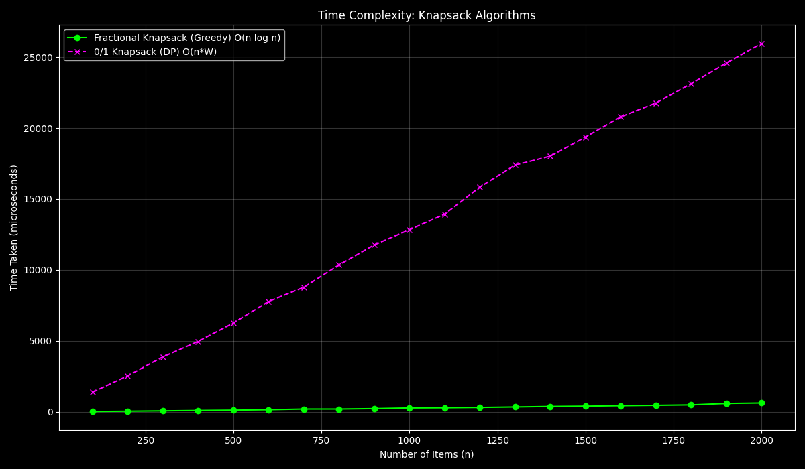
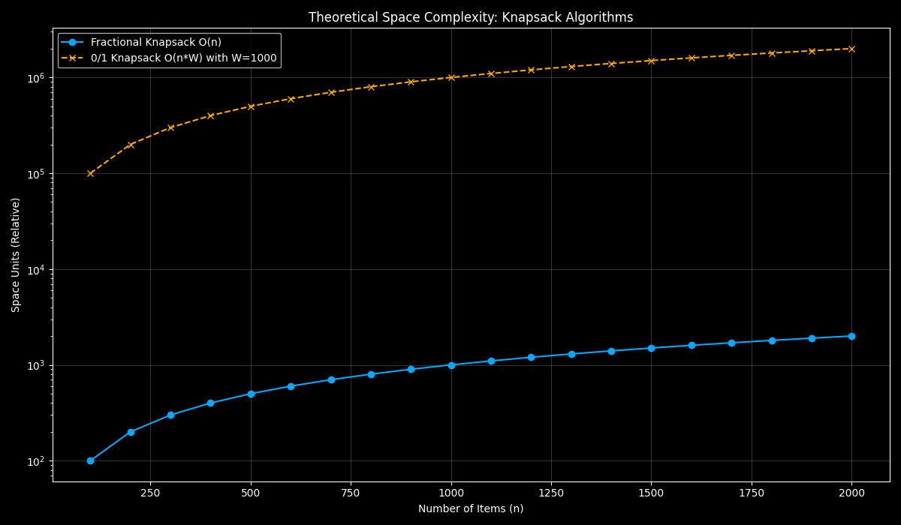

# Knapsack Problem: Greedy vs. Dynamic Programming

---

## Objective
To implement and analyze Greedy and Dynamic Programming approaches for solving the Knapsack problem and to compare their time and space complexities through graph-based analysis.

---

## 4(a) Fractional Knapsack Problem (Greedy Approach)

The Fractional Knapsack problem allows taking fractions of items. The optimal strategy is to greedily pick items with the highest value-to-weight ratio first.

### Algorithm

1. For each item, calculate its value-to-weight ratio (`value / weight`).
2. Sort all items in descending order based on their ratios.
3. Initialize `current_weight` to 0 and `final_value` to 0.
4. Iterate through the sorted items:
   * If adding the entire item doesn't exceed the knapsack's capacity, add it fully. Update `current_weight` and `final_value`.
   * If the item cannot be added fully, calculate the fraction of the item that can fit. Add this fraction's value to `final_value` and fill the knapsack completely. Break the loop.
5. Return `final_value`.

### Pseudocode

```
procedure fractional_knapsack(items, capacity):
  for each item in items:
    item.ratio = item.value / item.weight

  sort items by item.ratio in descending order

  total_value = 0
  current_weight = 0

  for each item in items:
    if current_weight + item.weight <= capacity:
      current_weight += item.weight
      total_value += item.value
    else:
      remaining_capacity = capacity - current_weight
      fraction = remaining_capacity / item.weight
      total_value += item.value * fraction
      break

  return total_value
```

### C Code

```c
#include <stdio.h>
#include <stdlib.h>
#include <time.h>

struct Item {
    int value;
    int weight;
};

int compareItems(const void* a, const void* b) {
    struct Item* itemA = (struct Item*)a;
    struct Item* itemB = (struct Item*)b;
    double r1 = (double)itemA->value / itemA->weight;
    double r2 = (double)itemB->value / itemB->weight;
    if (r1 < r2) return 1;
    if (r1 > r2) return -1;
    return 0;
}

double fractional_knapsack(struct Item* items, int n, int capacity) {
    qsort(items, n, sizeof(struct Item), compareItems);

    double total_value = 0.0;
    int current_weight = 0;

    for (int i = 0; i < n; i++) {
        if (current_weight + items[i].weight <= capacity) {
            current_weight += items[i].weight;
            total_value += items[i].value;
        } else {
            int remaining_capacity = capacity - current_weight;
            total_value += items[i].value * ((double)remaining_capacity / items[i].weight);
            break;
        }
    }
    return total_value;
}

int main() {
    int capacity = 1000;
    FILE *outfile = fopen("fractional_knapsack.txt", "w");

    printf("Fractional Knapsack (Greedy) Results (Capacity = %d):\n", capacity);
    printf("Items(n)\tTime(microseconds)\tResult\n");

    for (int n = 100; n <= 2000; n += 100) {
        struct Item* items = (struct Item*)malloc(n * sizeof(struct Item));
        for (int i = 0; i < n; ++i) {
            items[i].value = rand() % 100 + 1;
            items[i].weight = rand() % 50 + 1;
        }

        clock_t start = clock();
        double result = fractional_knapsack(items, n, capacity);
        clock_t end = clock();
        long long duration = (long long)(((double)(end - start)) * 1000000 / CLOCKS_PER_SEC);

        printf("%d\t\t%lld\t\t\t%.2f\n", n, duration, result);
        fprintf(outfile, "%d %lld\n", n, duration);
        free(items);
    }
    fclose(outfile);
    return 0;
}
```

---

## 4(b) 0/1 Knapsack Problem (Dynamic Programming)

The 0/1 Knapsack problem restricts you to either take an item entirely or leave it. This problem has optimal substructure and overlapping subproblems, making it suitable for Dynamic Programming.

### Algorithm

1. Create a DP table `dp[n+1][W+1]`, where `n` is the number of items and `W` is the knapsack capacity.
2. Initialize the first row and column of `dp` to 0.
3. Iterate from `i = 1` to `n` and `w = 1` to `W`:
   * If the weight of the `i`-th item is greater than the current capacity `w`, you cannot include it. So, `dp[i][w] = dp[i-1][w]`.
   * Otherwise, you have two choices:
     a.  Don't include the `i`-th item: `value = dp[i-1][w]`.
     b.  Include the `i`-th item: `value = value_i + dp[i-1][w - weight_i]`.
   * Set `dp[i][w]` to the maximum of these two choices.
4. The final answer is `dp[n][W]`.

### Pseudocode

```
procedure knapsack_01(values, weights, capacity):
  n = length of values
  create table dp[n+1][capacity+1] and initialize to 0

  for i from 1 to n:
    for w from 1 to capacity:
      if weights[i-1] <= w:
        dp[i][w] = max(values[i-1] + dp[i-1][w - weights[i-1]], dp[i-1][w])
      else:
        dp[i][w] = dp[i-1][w]

  return dp[n][capacity]
```

### C Code

```c
#include <stdio.h>
#include <stdlib.h>
#include <time.h>

struct Item {
    int value;
    int weight;
};

int max(int a, int b) {
    return (a > b) ? a : b;
}

int knapsack_01(const struct Item* items, int n, int capacity) {
    int** dp = (int**)malloc((n + 1) * sizeof(int*));
    for (int i = 0; i <= n; i++) {
        dp[i] = (int*)calloc(capacity + 1, sizeof(int));
    }

    for (int i = 1; i <= n; ++i) {
        for (int w = 1; w <= capacity; ++w) {
            if (items[i - 1].weight <= w) {
                dp[i][w] = max(
                    items[i - 1].value + dp[i - 1][w - items[i - 1].weight],
                    dp[i - 1][w]
                );
            } else {
                dp[i][w] = dp[i - 1][w];
            }
        }
    }
    int result = dp[n][capacity];

    for (int i = 0; i <= n; i++) {
        free(dp[i]);
    }
    free(dp);

    return result;
}

int main() {
    int capacity = 1000;
    FILE *outfile = fopen("01_knapsack.txt", "w");

    printf("0/1 Knapsack (DP) Results (Capacity = %d):\n", capacity);
    printf("Items(n)\tTime(microseconds)\tResult\n");

    for (int n = 100; n <= 2000; n += 100) {
        struct Item* items = (struct Item*)malloc(n * sizeof(struct Item));
        for (int i = 0; i < n; ++i) {
            items[i].value = rand() % 100 + 1;
            items[i].weight = rand() % 50 + 1;
        }

        clock_t start = clock();
        int result = knapsack_01(items, n, capacity);
        clock_t end = clock();
        long long duration = (long long)(((double)(end - start)) * 1000000 / CLOCKS_PER_SEC);

        printf("%d\t\t%lld\t\t\t%d\n", n, duration, result);
        fprintf(outfile, "%d %lld\n", n, duration);
        free(items);
    }
    fclose(outfile);
    return 0;
}
```

---

## Complexity Analysis

| Approach | Problem | Time Complexity | Space Complexity | Description |
|---|---|---|---|---|
| Greedy | Fractional Knapsack | O(n log n) | O(n) | Dominated by sorting. Very efficient. |
| Dynamic Programming | 0/1 Knapsack | O(n*W) | O(n*W) | Pseudo-polynomial. Performance depends on capacity `W`. |

---

## Python Code for Plotting

```python
import matplotlib.pyplot as plt
import numpy as np

plt.style.use('dark_background')

plt.figure(figsize=(12, 7))

n_f, time_f = [], []
try:
    with open("fractional_knapsack.txt") as f:
        for line in f:
            n, t = line.split()
            n_f.append(int(n))
            time_f.append(float(t))
    plt.plot(n_f, time_f, marker='o', color='#00ff00', linestyle='-', label='Fractional Knapsack (Greedy) O(n log n)')
except FileNotFoundError:
    print("Warning: fractional_knapsack.txt not found. Run the C code first.")

n_01, time_01 = [], []
try:
    with open("01_knapsack.txt") as f:
        for line in f:
            n, t = line.split()
            n_01.append(int(n))
            time_01.append(float(t))
    plt.plot(n_01, time_01, marker='x', color='#ff00ff', linestyle='--', label='0/1 Knapsack (DP) O(n*W)')
except FileNotFoundError:
    print("Warning: 01_knapsack.txt not found. Run the C code first.")


plt.xlabel("Number of Items (n)")
plt.ylabel("Time Taken (microseconds)")
plt.title("Time Complexity: Knapsack Algorithms")
plt.legend()
plt.grid(True, alpha=0.2)
plt.tight_layout()
plt.savefig("knapsack_time_comparison.png")
print("Time complexity plot saved as knapsack_time_comparison.png")

plt.figure(figsize=(12, 7))

n_range = np.array(n_01 if n_01 else [100, 2000])
W = 1000

space_f = n_range
space_01 = n_range * W

plt.plot(n_range, space_f, marker='o', color='#00aaff', linestyle='-', label='Fractional Knapsack O(n)')
plt.plot(n_range, space_01, marker='x', color='#ffa500', linestyle='--', label=f'0/1 Knapsack O(n*W) with W={W}')

plt.xlabel("Number of Items (n)")
plt.ylabel("Space Units (Relative)")
plt.title("Theoretical Space Complexity: Knapsack Algorithms")
plt.yscale('log')
plt.legend()
plt.grid(True, alpha=0.2)
plt.tight_layout()
plt.savefig("knapsack_space_comparison.png")
print("Space complexity plot saved as knapsack_space_comparison.png")
```

---

## Output Plots




